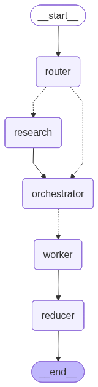

# 🧠 Agentic Blog Generation Orchestrator

An advanced, stateful multi-agent system built with **LangGraph** designed to automate high-quality, technically consistent blog post generation. This project leverages dynamic routing, parallelized content generation, and stateful synthesis to produce production-ready Markdown blogs efficiently.

---

## 📌 Introduction

The **Agentic Blog Generation Orchestrator** is a modular AI pipeline that simulates a team of intelligent agents working collaboratively. It ensures:

* Accurate, research-backed content
* Consistent tone and structure
* Efficient execution through parallelism
* Reduced hallucination via state tracking

It is ideal for developers, researchers, and content creators looking to automate long-form technical writing.

---

## 📚 Table of Contents

* [Workflow Architecture](#-workflow-architecture)
* [Node Breakdown](#-node-breakdown)
* [Key Features](#-key-features)
* [Tech Stack](#-tech-stack)
* [Installation & Setup](#-installation--setup)
* [Usage](#-usage)
* [Configuration](#-configuration)
* [Examples](#-examples)
* [Troubleshooting](#-troubleshooting)
* [Contributors](#-contributors)
* [License](#-license)

---

## 🔄 Workflow Architecture

The orchestrator follows a structured **Directed Acyclic Graph (DAG)**:

<p align="center">
  
</p>


This ensures both efficiency and high-quality output.

---

## 🧩 Node Breakdown

### 🔀 Router

* Determines if external research is required
* Optimizes token usage and latency

### 🔍 Research

* Uses Tavily Search API
* Fetches real-time and relevant technical data

### 🧠 Orchestrator

* Plans blog structure
* Breaks topic into logical sections

### ⚙️ Worker (Map)

* Generates sections in parallel
* Reduces total execution time significantly

### 🧮 Reducer

* Aggregates outputs
* Performs fact-checking
* Produces unified Markdown draft

---

## 🚀 Key Features

* **Dynamic Intelligence**
  Skips research for general topics to reduce API cost

* **Map-Reduce Pattern**
  Parallel execution using LangGraph Send API

* **State Management**
  Maintains global context for accuracy and consistency

* **Multi-LLM Support**
  Compatible with:

  * OpenAI (GPT-4o)
  * Gemini 1.5 Pro
  * Groq (Llama 3)

* **Markdown Optimized Output**
  Clean, structured, production-ready formatting

---

## 🛠 Tech Stack

| Category        | Technology                   |
| --------------- | ---------------------------- |
| Orchestration   | LangGraph, LangChain         |
| Language        | Python 3.10+                 |
| Search Engine   | Tavily Search API            |
| Models          | OpenAI, Gemini, Groq         |
| Interface       | Streamlit / Jupyter Notebook |
| Version Control | Git                          |

---

## ⚙️ Installation & Setup

### 1. Clone the Repository

```bash
git clone https://github.com/your-username/agentic-blog-orchestrator.git
cd agentic-blog-orchestrator
```

### 2. Install Dependencies

```bash
pip install -r requirements.txt
```

### 3. Configure Environment Variables

Create a `.env` file in the root directory:

```env
OPENAI_API_KEY=your_openai_key
TAVILY_API_KEY=your_tavily_key
GOOGLE_API_KEY=your_gemini_key
GROQ_API_KEY=your_groq_key
```

---

## ▶️ Usage

### Run via Streamlit UI

```bash
streamlit run app.py
```

### Run via CLI

```bash
python main.py --topic "The Future of Agentic AI in 2026"
```

---

## 🔧 Configuration

* Modify model selection in configuration files or environment variables
* Adjust parallel worker settings for performance tuning
* Customize prompts for tone, depth, or domain-specific output

---

## 💡 Examples

### Input

```
"The Future of Agentic AI in 2026"
```

### Output

* Structured Markdown blog
* Clearly separated sections
* Fact-checked and consistent narrative

---

## 🐞 Troubleshooting

| Issue                | Solution                                           |
| -------------------- | -------------------------------------------------- |
| API Key errors       | Ensure `.env` file is correctly configured         |
| Slow execution       | Reduce number of parallel workers or switch models |
| Inconsistent output  | Verify state management logic and prompt templates |
| Missing dependencies | Reinstall using `pip install -r requirements.txt`  |

---

## 👥 Contributors

* Your Name (@your-github-username)
* Open for contributions 🚀

---

## 📄 License

This project is licensed under the **MIT License**. Feel free to use, modify, and distribute.

---

## 🌟 Final Notes

This project demonstrates the power of **agentic workflows** in modern AI systems, combining reasoning, planning, and execution into a cohesive pipeline.

If you find this useful, consider ⭐ starring the repository!

---
